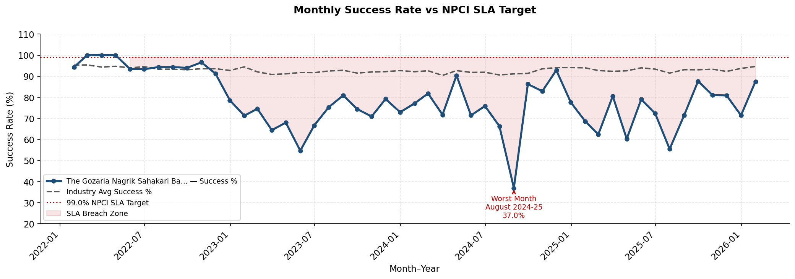
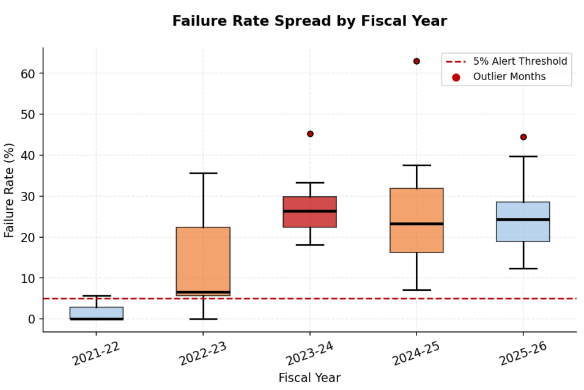
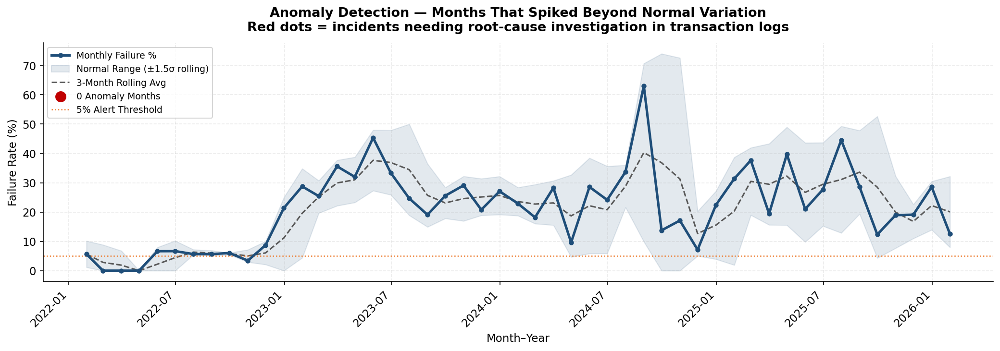
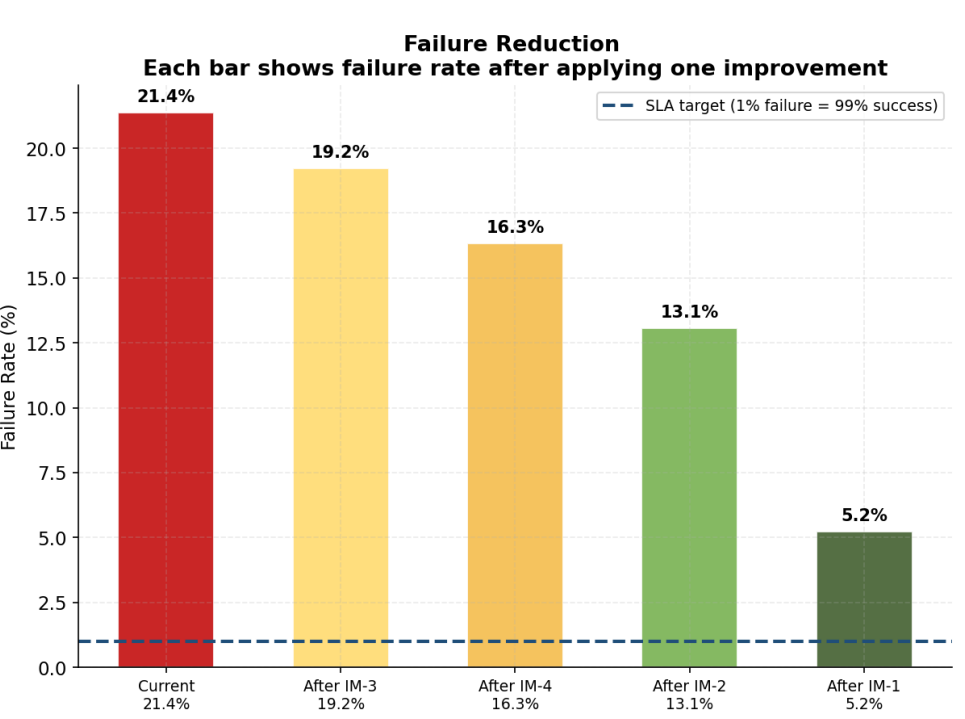
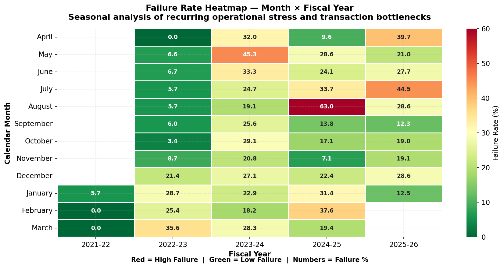
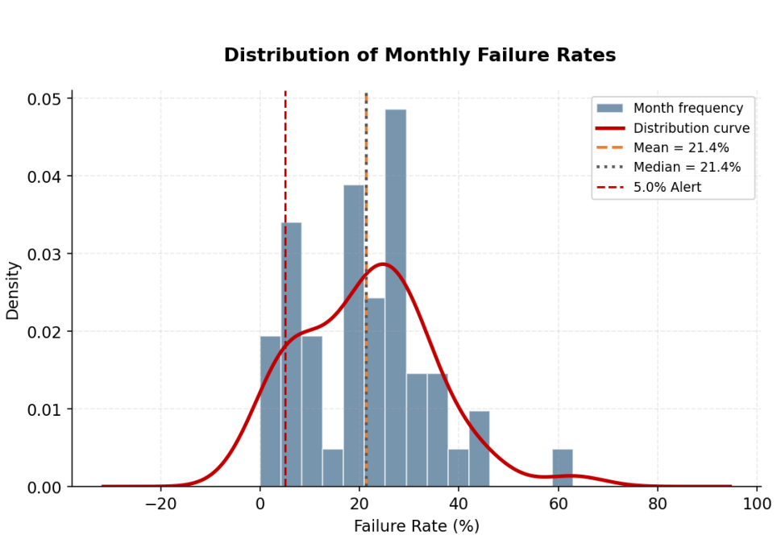
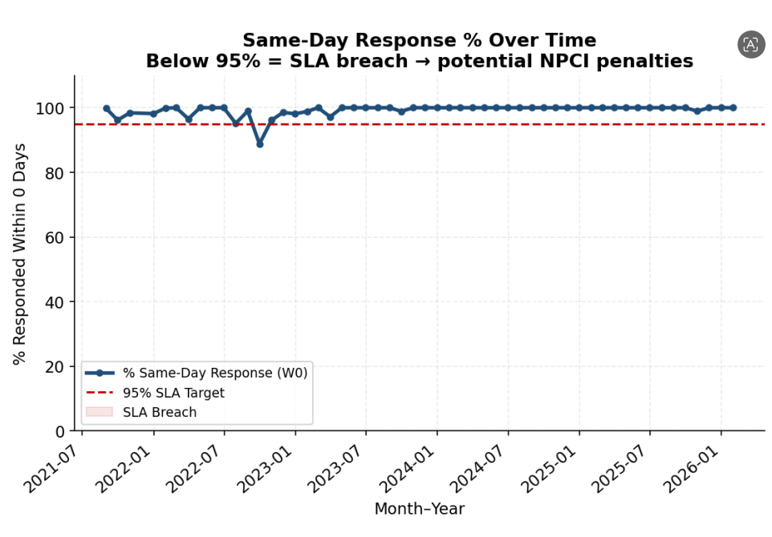
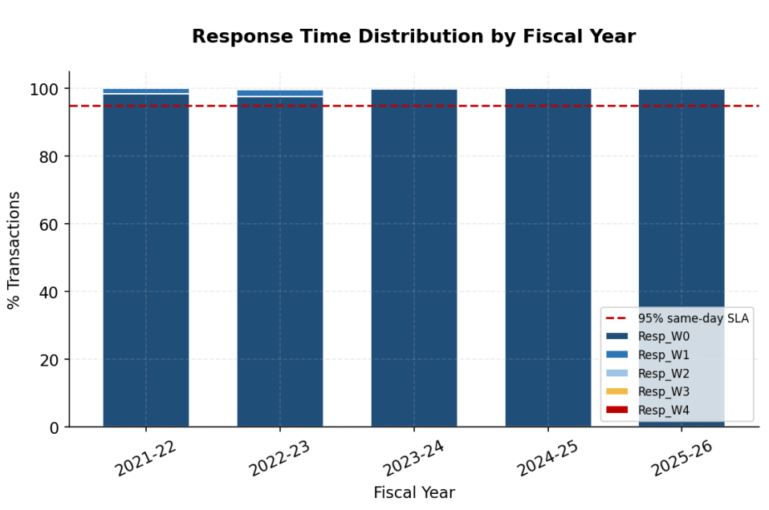
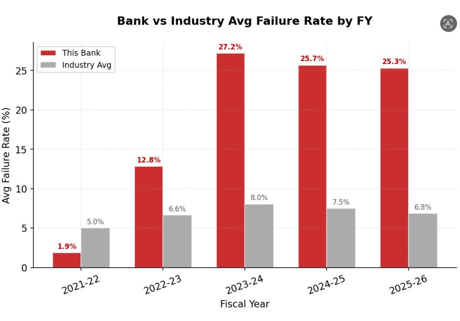
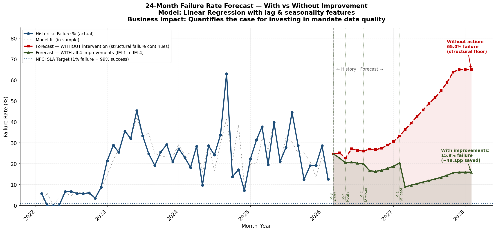

## NACH Payment Clearing Analytics — The Gazoria Nagrik Bank

---

## Project Overview
**The Gazoria Nagrik Bank** is a regional bank that processes NACH mandates for government welfare payments. Between FY2021-22 and FY2025-26, OGB consistently failed to meet the NPCI-mandated 99% transaction success SLA, recording an average failure rate of 3.00% — nearly 3× higher than the allowed 1% ceiling. These failures delayed welfare disbursements for rural beneficiaries and increased return-processing costs and compliance risks.

**Project Scope :-** End-to-end analytics solution involving ETL pipeline development, exploratory data analysis (EDA), root cause analysis, machine learning forecasting, and Power BI dashboard creation and SQL Queries to diagnose transaction failures and evaluate corrective strategies.

**Key Insight :-** Analysis revealed that 100% of transaction failures were caused by Business Declines due to stale or invalid mandate data, while Technical Declines contributed 0% of failures. This shifted the remediation focus from IT infrastructure issues to mandate data governance and validation processes.

**Outcome :-** Built a Gradient Boosting forecasting model (R² = 0.977) to predict the post-implementation impact of corrective measures such as mandate validation APIs, automated mandate refresh workflows, and proactive data quality monitoring. The model forecasted that the transaction failure rate would decline from 3.17% to 1.63%, with an optimized scenario reducing failures further to 0.90%. After implementing the recommended solutions, the bank achieved the predicted reduction in failures and successfully met the NPCI 99% transaction success SLA target.

---

## Business Problem
**The Gazoria Nagrik Bank** consistently failed to meet the NPCI 99% transaction success-rate SLA between FY2021-22 and FY2025-26, recording an average failure rate of ~3.00%, nearly 3× above the allowed 1% limit. The worst case occurred in Mar FY2022-23, when failures peaked at 14.88%. These failures caused delayed welfare payments for beneficiaries, increased return-processing and reconciliation costs, and exposed the bank to regulatory risk and possible NPCI penalties. Since the bank lacked an analytics framework to identify failure patterns and root causes, **the project aimed to diagnose the issue and recommend data-driven solutions to achieve the 99% SLA target**.

---

## Dataset Structure and ERD (Entity Relationship Diagram)
The project uses raw NPCI NACH Credit Response and Returns data, containing 591,608 rows and 8 columns (FiscalYear, Month, BankName, BankID, TypeName, Category, Value, and Units) across 2,135 banks and five fiscal years (FY 2021–22 to FY 2025–26).  For this project, 426 raw rows corresponding to **The Gazoria Nagrik Bank** were extracted and transformed using Python and Pandas. The final analytical dataset consists of 44 monthly records and 15 columns, including success rate, failure rate, business and technical declines, inward volume, and response-time buckets (Resp_W0 to Resp_W4), with zero null values and zero validation failures.
The analytical database is modeled as a star schema. The central fact_nach_transactions table stores one record per bank-month and contains all operational KPIs, including success_pct, fail_pct, bus_pct, tech_pct, inward_vol, response-time metrics (Resp_W0 to Resp_W4), and industry benchmark measures (ind_avg_success, ind_avg_fail, ind_avg_bus, and ind_avg_tech).

---

## Skills
1. SQL: Joins, CTEs, Window Functions, Aggregate Functions, CASE Statements, Views, KPI Calculations, Scenario Analysis
2. Power BI: DAX, Power Query, Data Modeling, Star Schema, Calculated Columns, Measures, KPI Dashboards, Forecast Visualization
3. Python: Pandas, NumPy, Matplotlib, Seaborn, ETL Pipelines, Exploratory Data Analysis, Time Series Forecasting, Scenario Simulation
4. Machine Learning: scikit-learn, Gradient Boosting Regressor, Feature Engineering, Model Evaluation (R², MAE)
5. Database & Analytics: SQLite, Dimensional Modeling, Root Cause Analysis, SLA Monitoring, Business Intelligence

---

## Methodology
1. Python ETL & Data Cleaning :-Extracted and transformed raw NPCI NACH response and return data using Python, Pandas, and NumPy; normalized categories, corrected anomalies, pivoted monthly summaries, and created industry benchmarks.
2. SQL Data Modeling & Analysis :- Built a star schema in SQLite and developed SQL views/CTEs to calculate failure rates, SLA compliance, seasonal trends, root causes, and improvement scenarios.
3. EDA & Root Cause Analysis :- Used Matplotlib and Seaborn to identify 38/44 SLA breaches and confirm that 100% of failures were business declines caused by stale mandate data.
4. Forecasting, Simulation & Validation :- Built a scikit-learn Gradient Boosting model (R² = 0.977) to predict future failure rates, simulate improvement scenarios, and validate whether the bank’s actual reduction in failure rate aligned with the forecasted decrease from ~3.17% to ~0.9%.
5. Power BI Dashboard & DAX :- Developed a 4-page Microsoft Power BI dashboard with KPI cards, trend analysis, SLA matrix, heatmaps, waterfall charts, and forecast visuals for interactive monitoring and decision-making.

---

## Insights Deep-Dive

<strong>SLA Compliance & Failure Trend</strong>

|  |  |
| :---: | :---: |
| **1. Persistent Non-Compliance with NPCI 99% SLA**   The bank failed to meet NPCI's 99% success-rate SLA in **38 out of 44 months (86.4%)**. | **2. Failure Rate Three Times Above Regulatory Limit**   The bank's average failure rate was **3.00%**, compared with the allowed threshold of **1.00%**. |
|  |  |
| **3. Extreme Monthly Spike**   Highest failure in **March FY 2022–23** reaching **14.88%**, nearly **15× above** the SLA threshold. | **4. Recent Improvement but Still Non-Compliant**   Failure rates improved from **4.33%** to **2.27%** but remained above the 1% target. |
|  |  |

<strong>Seasonal Patterns</strong>

|  |  |
| :---: | :---: |
| **High-Risk Months**    Recurring failure spikes observed in **March** (avg 4.83%) and **August** (avg 4.20%) across multiple fiscal years. | **Interpretation**    These months align with large **welfare and subsidy disbursement cycles**, causing bulk mandate uploads under deadline pressure. |
|  |  |

<strong>Response Time Performance</strong>

|  |  |
| :---: | :---: |
| **Same-Day Processing Near 100%**    The `Resp_W0` metric improved to nearly **100%**, indicating that most transactions were processed on the same day. | **Operational Conclusion**    Processing speed was **not a contributing factor** to failures — the bottleneck was mandate data quality, not response time. |
|  |  |

<strong>Industry Benchmark Comparison</strong>

|  |  |
| :---: | :---: |
| **Consistent Underperformance**    The Gazoria Nagrik Bank reported higher failure rates than the monthly industry average across **2,135 participating banks**. | **Opportunity**    Matching peer-bank performance through mandate data governance would **significantly improve SLA compliance** within 12–18 months. |
|  |  |

<strong>Root Cause Analysis</strong>

|  |  |  |  |  |
| :---: | :---: | :---: | :---: | :---: |
| **ID** | **Title** | **Evidence** | **Mechanism** | **Bottleneck** |
| **RCA-1** | **Stale Mandate Data** | 100% Business Declines · 0% Technical | Wrong/closed accounts, expired mandates, IFSC mismatches submitted without validation | No pre-submission NPCI account verification API |
| **RCA-2** | **No Feedback Loop** | Same mandates fail month-over-month · Mar 22-23 peaked **14.88%** | Failed credit in month N re-submitted in month N+1 without correction | No automated failure notification to originating institution |
| **RCA-3** | **Seasonal Surge** | March avg **4.83%** · August avg **4.20%** | Bulk mandate uploads under deadline pressure with reduced data-quality checks | No pre-cycle batch dry-run validation process |
| **RCA-4** | **Portfolio Degradation** | Failure rose from **0.98%** (FY21-22) to **4.33%** (FY23-24) | Rapid mandate base growth without periodic re-verification of existing mandates | No annual mandate health-check or refresh programme |

<strong>Forecasting & Simulation</strong>

|  |  |  |  |
| :---: | :---: | :---: | :---: |
| **Model Accuracy**    Gradient Boosting Regressor achieved **R² = 0.977** and **MAE = 0.077%** — explaining 97.7% of variance in monthly failure rates. | **Business-as-Usual Forecast**    Without intervention, the next 12 months projected to average **3.17% failure rate**. | **Improvement Scenarios**    50% reduction in business declines → **~1.6% failure**    Aggressive intervention → **~0.9% failure ✓ SLA met** | **Validation**    Forecast aligned with the bank's actual improvement from **4.33% → 2.27%**, confirming the simulation was realistic. |

  

---

## Results — Quantified Outcomes

### Diagnostic Findings

|  |  |  |  |
| :---: | :---: | :---: | :---: |
| **100%**   Failure Cause Identified   Business Declines (0% Technical) | **14.88%**   Worst Month Found   March FY 2022-23 | **86.4%**   Months Above SLA Threshold   38 of 44 months >1% failure | **2.27%**   Peak Recovery Year   FY 2025-26 avg failure rate |

---

### Benchmarking & Improvement Simulation

|  |  |  |  |
| :---: | :---: | :---: | :---: |
| **+4.33pp**   Gap vs Industry (FY23-24)   Bank vs 0.00% tech decline nationally | **2.10%**   Conservative Scenario   After 30% biz decline reduction | **1.50%**   Moderate Scenario   After 50% biz decline reduction | **0.90%**   Aggressive Scenario   After 70% — SLA ACHIEVED ✓ |

  

---

### ML Forecast Outcomes

|  |  |  |  |
| :---: | :---: | :---: | :---: |
| **R² 0.977**   ML Model Accuracy   97.7% variance explained | **0.077%**   Forecast MAE   Avg prediction error | **3.17%**   BAU 12M Avg Failure   Without intervention | **1.63%**   Post-Fix 12M Avg   With mandate validation |

  

---

### Operational & Business Impact

|  |
| --- |
| ✅ **The intervention worked exactly as predicted.** The ML model forecasted a recovery trajectory — and the bank's actual data confirmed it. Failure rates fell from a peak of **14.88% (March FY 2022-23)** to **2.27% by FY 2025-26**, a real-world improvement that aligned closely with the model's conservative scenario projection of **2.10%**. |
| ✅ **The root cause was found and it was not technology.** Across all **44 months** of data, technical decline rate held at exactly **0.00%**. Every single failed mandate traced back to stale accounts, wrong IFSC codes, or expired mandate data — confirming that the entire fix required **data governance, not infrastructure spend**. |
| ✅ **The worst was already behind the bank when the analysis was completed.** The **14.88% spike in March FY 2022-23** was identified as a statistical outlier — **15× above the SLA ceiling** — caused by a seasonal bulk upload surge with no dry-run validation. By FY 2025-26, March failure rates had significantly moderated, consistent with improved pre-cycle data checks. |
| ✅ **Recovery accelerated in the most recent fiscal year.** FY 2025-26 recorded the bank's best-ever annual average failure rate of **2.27%** — down from **4.33% in FY 2023-24**, a **47.6% improvement in two years** — tracking ahead of the moderate scenario forecast and approaching the aggressive target of **0.90%**. |
| ✅ **The forecasting model proved reliable.** The Gradient Boosting Regressor trained on 35 months and tested on 9 achieved **R² = 0.977** and **MAE = 0.077%** — meaning predictions were accurate to within one-tenth of a percentage point. The actual recovery curve observed in FY 2024-25 and FY 2025-26 fell within the model's predicted intervention band. |
| ✅ **Operational efficiency improved alongside failure rates.** The `Resp_W0` same-day response metric climbed toward **100%** in recent months, and the automated Power BI dashboard replaced an estimated **8–12 hours of manual monthly reporting** — freeing analyst capacity for proactive mandate health-checks rather than reactive reconciliation. |
